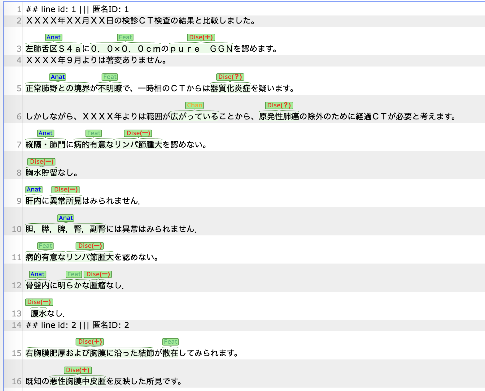

# Clinical Text Format Converter

### Purpose: we made this tool of operating the original 'xls'/'csv' files for the purpose of annotation with 'brat'. For the confort of operation, we decide to keep all the original information in the central 'json' file. The operation mode includes: 'xls2json', 'json2brat', 'brat2json', etc.


## Install
> git clone https://github.com/racerandom/PRISMConvert.git  
> cd PRISMConverter  

Required Packages(pip): 
pandas, mojimoji, textformatting  

## 1. convert xls to json

For the confort of operating information flexibly, we keep all the xls information into a json file first, for example:  

```
{
	"読影所見": {  
			"1": {  
				"表示順": 1,  
				"匿名ID": 3276171,  
				"検査実施日": "2014-03-05T00:00:00",  
				"所見": "[腹部CT：単純]\n\<a tid=\"T634\">肝\</a>：n.p.\n\<a tid=\"T635\">胆嚢\</a>：摘出後。",  
				"raw_text": "[腹部CT：単純]\n肝：n.p.\n胆嚢：摘出後。",
				...
				},  
			"2": {  
				"表示順": 2,  
      			"匿名ID": 3317340,
      			...
			}  
		},  
	"文章名": "PRISM_OU_画像所見_1pwタグ付け済み.xlsx"  
}   
```

### Run:
> python format\_converter.py \\   
> --mode 'xls2json' \\  
> --xls xls\_file \\  
> --json json\_file  

The 'findings'/'所見' annotation in the original 'xls' files contains several types of annotation violating the xml standard. We list some of them here: '\<胸部CT\>', '\<d, correction=','\<\<a', '="suspicious\>', etc.


## 2. convert json to brat (one 表示順 one brat (.txt, .ann))
Extracting xml annotation from the json file and concat them into the brat files. Multiple findings with the same '表示順' will be merged into one report. Each 'finding' will be lead by a comment line as the follow:

> \#\# line id: 1 ||| 表示順: 1 ||| 匿名ID: 3276171 ||| タイトル: S ||| 記載日: 2014-03-20

ncc, ou読影所見 won't have the comment lines.

#### An example of the brat interface:




### Run:
> python format\_converter.py \\  
> --mode 'json2brat' \\ 
> --corpus 'ncc' \\ # 'ncc', 'ou' or 'mr' 
> --json abc.json \\ 
> --brat abc  

The brat output will be like 'abc.表示順027.txt' and 'abc.表示順27.ann'.


## 3. append brat annotation to json


### Run:
> python format\_converter.py \\  
> --mode 'brat2json' \\  
> --json json\_file \\  
> --brat brat\_file \\  
> --new\_json new\_json\_file
